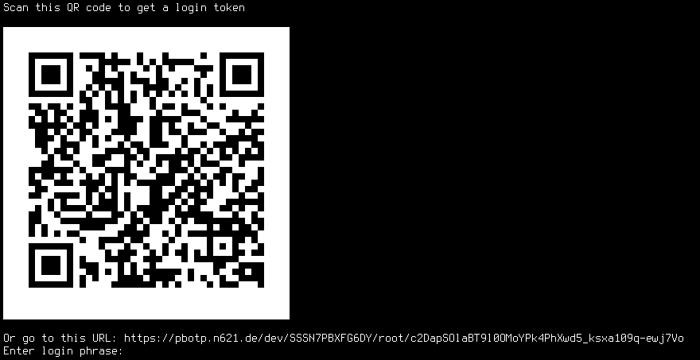
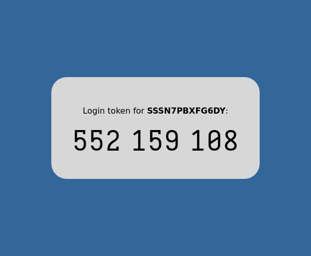

# Introduction

`pbotp` is a public-key based OTP mechanism. Its goal is to allow a central server to control and audit access to a number of devices without having to register the devices on the server beforehand, share secrets, synchronize time, etc. This is achieved through a public-key based challenge-response scheme where the device only needs to be configured with the server's public key.

Furthermore, it is meant to be usable on devices that are not online, so the challenge-response mechanism must be structured in such a way that it can be conveniently mediated by a human operator.

# Operation

When a user tries to log into a device, they are presented with a challenge:



Besides containing a cryptographic challenge, the URL encodes all relevant information about the login attempt, namely the target device name, group and the login username. The device group is included as a means for the server to issue authorization based on a shared characteristic of some devices instead of having to know the name of any single device from such a group that a user might want to access beforehand.

The QR code is used as a convenient way of transferring the URL to another device, but does not contain any additional information.

The user then opens this URL on their private device. The server might require some authentication (e.g. via SSO) and then authorizes access based on the parameters supplied via the URL. If the user is authorized to log into the device, the server executes a cryptographic operation (described below) using its private key, the login information and the challenge, producing a one-time code that can be used to log into the device:



If the login attempt fails, a new challenge is generated and the user can try again.

# Cryptographic mechanism

The following primitives are used:

  * X25519, [RFC7748](https://datatracker.ietf.org/doc/html/rfc7748)
  * HMAC, [RFC2104](https://datatracker.ietf.org/doc/html/rfc2104) instantiated with SHA-256, [RFC6234](https://datatracker.ietf.org/doc/html/rfc6234)

The server public key (`server_pub_key`) is a X25519 public key. It is generated by taking 32 random bytes (`server_sec_key`) and calculating `server_pub_key := X25519(server_sec_key, 9)`, where `9` is the Curve25519 base point. This public key is stored on each device that wishes to facilitate authentication through this server.

For each login attempt, the device randomly generates a fresh 32 byte nonce (`nonce`) and calculates `challenge := X25519(nonce, 9)`. Furthermore, it calculates `dh_secret := X25519(nonce, server_pub_key)`. The challenge is transmitted to the server alongside the login data (`login_data`). The server can derive the same `dh_secret` value by calculating `X25519(server_sec_key, challenge)`. This is exactly the procedure described in Section 6.1 of RFC7748.

Both server and client can now calculate a 32 byte authentication code (`response`) by executing an HMAC operation with key `dh_secret` over `login_data`. `login_data` is considered an opaque blob here, but serves to bind the result of the exchange to a specific device. A possible format of `login_data` is described below.

## Response formatting

Two methods of formatting `response` into a one-time code that can easily be transferred manually are defined. This code is entered on the device by the user and the device can check for equivalence with the code it calculated, thus allowing the user to prove they have access to the server corresponding to `server_pub_key`.

Which of the following options (and their `length` parameter) is chosen must be defined beforehand in a given system, or it could be transferred to the server alongside the challenge.

Both methods truncate `response` to some extent depending on the `length` parameter. Thus, while being more convenient, a shorter `length` makes brute-forcing the login easier and needs to be carefully chosen for a given application.

### Numerical code

The first 8 bytes of `response` are considered a 64 bit little endian number `P`.

A `length`-digit code is generated as `code := P % 10^length`, padding with leading zeros to `length` digits if necessary.

Note that this introduces modulo bias, i.e. the `code` values are not uniformly distributed. However, similar systems such as HOTP ([RFC4226](https://datatracker.ietf.org/doc/html/rfc4226)) suffer from the same effect and consider it to be acceptable.

### Code phrase

`response` is considered a 256 bit little endian number (`N_response`).

Then, `length` words are drawn from the [English BIP39 word list](https://github.com/bitcoin/bips/blob/master/bip-0039/english.txt) by repeatedly taking the 11 least significant bits of `N_response` as an index into this list and then shifting `N_response` 11 bits to the right. The code phrase is the result of concatenating these words with spaces.

## Considerations

The "null check" described in Section 7 of RFC7748 was not included. It is [subject to debate](https://moderncrypto.org/mail-archive/curves/2017/000896.html) whether this is useful in general and was not deemed to be important in this particular protocol since an honest client never triggers this behavior and an attacker neither learns anything about the private key of the server by doing this, nor do they receive an authentication code that is useful for anything.

Usually, using the result of DH key exchange as a key without an additional key-derivation step is considered suspect. However, in this case, it [can be shown](https://doi.org/10.1145/1368310.1368317) that `response` will still be indistinguishable from a random bitstring, which is what we want.

It is important that `login_data` contains all the parameters the server uses to make an authorization decision. Otherwise, a malicious user can trick the authorization server into thinking it is generating a code for a device that they legitimately might have access to, when in fact accessing another device.

The two different ways of encoding the response are presented to allow different trade-offs in a given application. A digital code can be robustly transferred but has (as a direct consequence) low information density. Thus, long codes are required to be robust against brute-force attempts. Shorter codes might however be appropriate as a second factor, for example.

Code phrases are more compact (three random words from a 2048-element list have approximately equivalent entropy to a 10-digit code), but are language-dependent and more error prone to input.

# Implementation choices

This section describes the choices that were made when instantiating the above algorithm into the login mechanism implemented in this repository.

When necessary (such in the case of encoding the challenge into an URL), URL-safe Base64 (see Section 5 of [RFC4648](https://datatracker.ietf.org/doc/html/rfc4648)) without padding is used. 32 bytes encode into 43 characters.

The provided implementation of the above scheme encodes the following parameters into `login_data`:

  * The device group
  * The device host name
  * The user to log into

All these parameters are case-sensitive and limited to ASCII strings from the URL-safe character set from Table 2 of RFC4648.

`login_data` is set to `group NUL hostname NUL user NUL` (where `NUL` is the ASCII character with the value 0) and the corresponding URL suffix below some base URL is `group '/' hostname '/' user '/' base64url_encode(challenge)`.

The QR code uses 8-bit encoding to accomodate case sensitive strings, such as the base64 encoding. The QR format would allow for more efficient encoding of the data at hand, but the absolute gains in code size are small compared to the added complexity. For example a base-10 encoding of the challenge would still be URL-safe and would be much more compact to represent in a numerically encoded QR code segment than the equivalent base64 encoding, but would result in a much more unweildy URL. A low error correction level was found to be sufficient.

# Example

In the following, a complete login procedure is described step by step, with intermediate values.

## Server key generation

32 random bytes are chosen (`server_sec_key`):
``` none
  0000  cc 64 4c 01 74 68 48 ac  0c 64 6e 44 33 ef c1 fa  .dL.thH..dnD3...
  0010  cf 28 c5 37 c8 09 c7 c1  88 dd 4f 00 70 82 a9 5a  .(.7......O.p..Z
```
This results in an ASCII-armored private key of `zGRMAXRoSKwMZG5EM-_B-s8oxTfICcfBiN1PAHCCqVo`.

The resulting public key (`server_pub_key`) is:
``` none
  0000  66 78 36 f0 b2 18 a6 1a  9b 6f 0a 84 7e f7 13 e2  fx6......o..~...
  0010  70 2c 87 36 b3 34 4e 65  0e e4 af 44 98 eb 4a 04  p,.6.4Ne...D..J.
```
With its encoding being `Zng28LIYphqbbwqEfvcT4nAshzazNE5lDuSvRJjrSgQ`.

## Login procedure

The device host name is `SSSN7PBXFG6DY`, its group is `dev` and the login user is `root`, resulting in a `login_data` value of:

``` none
  0000  64 65 76 00 53 53 53 4e  37 50 42 58 46 47 36 44  dev.SSSN7PBXFG6D
  0010  59 00 72 6f 6f 74 00                              Y.root.
```

`nonce` is generated randomly:
``` none
  0000  3e 2a 27 be c0 47 58 54  6b 5c d2 93 1b 80 9d 56  >*'..GXTk\.....V
  0010  f3 82 e8 10 52 6c 3a e1  cc 61 f8 61 e5 86 93 5f  ....Rl:..a.a..._
```

`challenge` is:
``` none
  0000  73 60 da a5 23 a5 68 14  fd 97 43 8c a1 83 e4 e0  s`..#.h...C.....
  0010  f8 57 c1 de 7f 92 cc 5a  d7 4f 6a f9 ec 23 ed 5a  .W.....Z.Oj..#.Z
```

`dh_secret` is:
``` none
  0000  c7 aa 35 95 d4 8b 82 fe  d1 4e f7 b6 08 52 43 78  ..5......N...RCx
  0010  f2 28 76 fa b9 e9 09 b8  97 9b 92 53 d0 9a 2b 2a  .(v........S..+*
```

This concludes the public-key phase. Using this key to calculate the HMAC of `login_data` results in a `response` value of:

``` none
  0000  84 71 db 51 79 58 38 49  70 bc 72 29 48 ca 60 e4  .q.QyX8Ip.r)H.`.
  0010  0a 98 b3 7f 5b 99 d2 18  9d b7 ae b3 d4 36 de 50  ....[........6.P
```

To generate a 9-digit authentication code, the bytestring `84 71 db 51 79 58 38 49` is interpreted as the number `0x4938587951db7184` (`5276064241552159108` in decimal) and the value modulo `10^9` is calculated (`552159108`) to produce the final authentication code.

For the "code phrase" mechanism, the 4-word phrase is `correct horse pottery maple`.

The maximum-length phrase (23 words) is `correct horse pottery maple idle banner toe increase ahead circle corn purity copy undo swim off bottom inner forward depend practice misery manage`.
